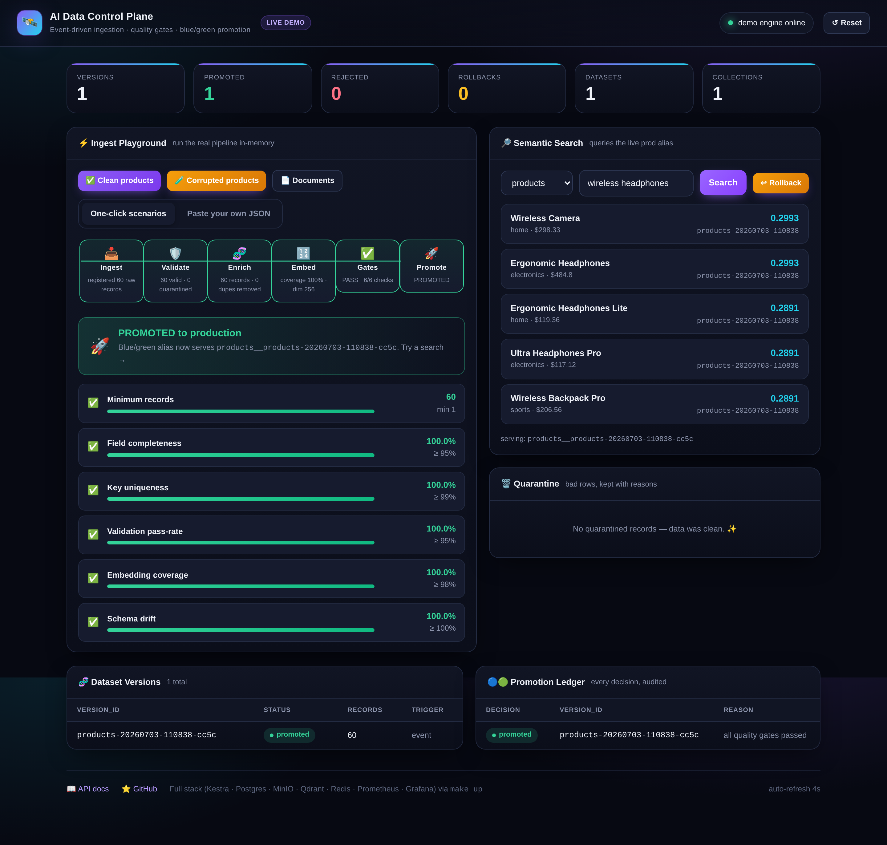
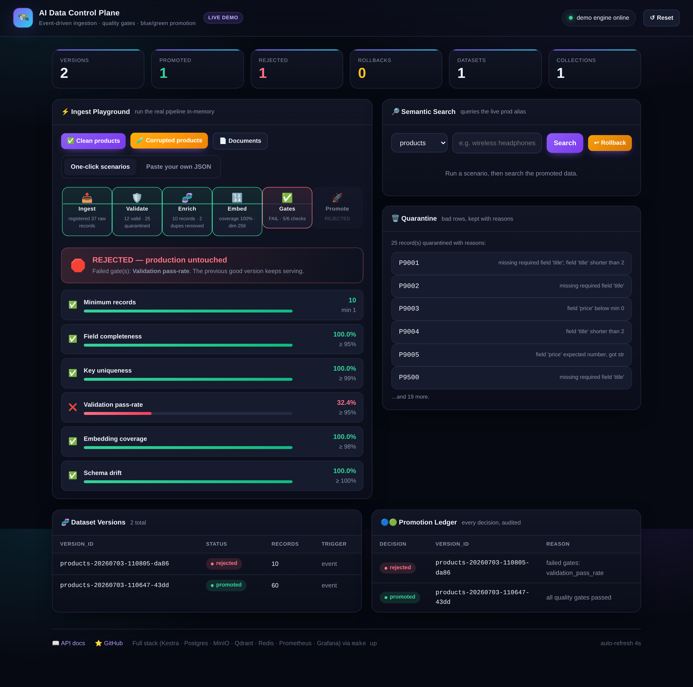

<div align="center">

# AI Data Control Plane

An event-driven orchestration platform that keeps AI and data systems fresh,
validated, and safe to promote — built on [Kestra](https://kestra.io).

[](https://github.com/RomitDeokar/AI-Data-Control-Plane/actions/workflows/ci.yml)


[Quickstart](#quickstart) ·
[Architecture](#architecture) ·
[Lifecycle](#how-it-works-the-lifecycle) ·
[Reliability](#reliability-guarantees) ·
[Design decisions](#design-decisions--tradeoffs) ·
[Limitations](#limitations--non-goals)

</div>

---

## Overview

This project is the layer *above* a single ingest-and-embed pipeline: the system
that decides **whether new data is allowed into production**. It ingests data
from files, webhooks, and schedules; validates and enriches it; generates
embeddings; runs a suite of explicit **quality gates**; and only then performs a
**blue/green promotion** to production — with instant rollback if something goes
wrong. Every version, check, and promotion is written to an audit ledger and
exposed through Prometheus/Grafana and a live web console.

The orchestration is expressed as thin [Kestra YAML flows](flows/); all business
logic lives in a tested Python library ([`controlplane/`](controlplane/)) invoked
through a single CLI (`python -m controlplane.runner <stage>`). This keeps flows
readable and logic unit-testable.

---

## Feature highlights

- **Multiple triggers** — file upload, JSON webhook, cron schedule, and an
  internal event bus (Redis Streams).
- **Data zones** — `raw → staged → quarantine → artifacts` object-storage layout
  (MinIO / S3-compatible).
- **Schema validation + drift detection** — bad rows are quarantined with
  reasons rather than silently dropped.
- **Deterministic enrichment** — Unicode normalization, dedup, derived metadata
  and lineage tags.
- **Pluggable embeddings** — a zero-dependency feature-hashing embedder; swap for
  SentenceTransformers/OpenAI behind one interface.
- **Quality gates** — min-records, completeness, uniqueness, validation
  pass-rate, embedding coverage, and schema drift. All must pass to promote.
- **Blue/green promotion** — each version gets its own Qdrant collection;
  production reads through a stable alias; promotion is an atomic alias switch.
- **Instant rollback** — zero-copy, sub-second revert to the previous promoted
  version, selected deterministically from the promotion ledger.
- **Full audit trail** — a Postgres ledger of every version, quality check,
  promotion, and quarantined record.
- **Observability** — Prometheus metrics, a provisioned Grafana dashboard, and a
  live web console.
- **Resilience** — per-task retries with exponential backoff, timeouts,
  content-hash idempotency, a durable event relay, and a dead-letter queue for
  poison events.
- **Tested** — unit, integration, and flow-YAML tests, plus a no-Docker
  end-to-end simulation that runs the whole lifecycle in-process.

---

## The web console

An interactive control-plane dashboard that runs standalone with no external
infrastructure: an in-memory demo engine reuses the real validation, gate,
promotion, and search logic. Open the gateway and drive the whole lifecycle from
the browser.

**Promotion path — a clean dataset passes every gate and is blue/green-promoted;
semantic search then serves it live:**



**Rejection path — a corrupted dataset is quarantined, fails the quality gates,
and is rejected; production stays untouched:**



> The 6-stage pipeline stepper, gate scorecard, promote/reject verdict, quarantine
> reasons, semantic search, version-detail drawer, and audit tables are all driven
> by the same engine that powers the real Kestra flows.

---

## Architecture

```
                              ┌──────────────────────┐
      File upload  ─────┐     │       Gateway        │
      JSON webhook ─────┼────▶│  (FastAPI + Web UI)  │
      Cron schedule ────┘     │  validate • hash •   │
                              │  raw-zone • publish  │
                              └──────────┬───────────┘
                                         │ dataset.ingested
                                         ▼
                              ┌──────────────────────┐
                              │  Event Bus (Redis    │  idempotency · dispatched
                              │  Streams)            │  flag · relay · DLQ
                              └──────────┬───────────┘
                          trigger now ▲  │ dataset.ingested (dispatched=false)
                                       │  ▼
                              ┌──────────────────────┐
                              │  Event Relay (cron)  │  re-drives stranded events
                              │  controlplane.relay  │  → DLQ after N attempts
                              └──────────┬───────────┘
                                         ▼
                    ┌────────────────────────────────────────┐
                    │        KESTRA — the orchestrator        │
                    │   dataset-pipeline (flagship flow)      │
                    └────────────────────┬───────────────────┘
                                         │
        ┌──────────┬──────────┬──────────┼──────────┬───────────┬──────────┐
        ▼          ▼          ▼           ▼          ▼           ▼          ▼
    ┌───────┐ ┌────────┐ ┌─────────┐ ┌───────┐ ┌────────┐ ┌────────┐ ┌────────┐
    │INGEST │ │VALIDATE│ │ ENRICH  │ │ EMBED │ │ QUALITY│ │PROMOTE │ │SUMMARY │
    │       │ │ +drift │ │∥ PROFILE│ │       │ │  GATES │ │ or     │ │+alerts │
    │       │ │        │ │(parallel│ │       │ │        │ │ REJECT │ │        │
    └───┬───┘ └───┬────┘ └────┬────┘ └───┬───┘ └───┬────┘ └───┬────┘ └────────┘
        │         │           │          │         │          │
        ▼         ▼           ▼          ▼         ▼          ▼
  ┌───────────────────────────────────────────────────────────────────┐
  │  MinIO (raw/staged/quarantine/artifacts) · Postgres registry ·     │
  │  Qdrant (version collections + prod alias) · Prometheus/Grafana    │
  └───────────────────────────────────────────────────────────────────┘
```

Only versions that pass every gate get promoted. Promotion is an atomic alias
switch in Qdrant, so production traffic (via `/search`) cuts over instantly, and
rollback is the same switch in reverse.

A deeper walkthrough of each component and the design rationale is in
**[docs/architecture.md](docs/architecture.md)**.

### Tech stack

| Layer | Technology |
| --- | --- |
| Orchestration | **Kestra** (YAML flows: triggers, retries, parallel/subflows, artifacts) |
| Gateway / API | **FastAPI** + Uvicorn + a vanilla-JS web console |
| Event bus | **Redis Streams** (consumer groups, idempotency, DLQ) |
| Object storage | **MinIO** (S3-compatible) |
| Vector store | **Qdrant** (collections + aliases for blue/green) |
| Metadata registry | **PostgreSQL** (audit ledger) |
| Observability | **Prometheus** + **Grafana** (auto-provisioned) |
| Packaging / CI | **Docker Compose**, **GitHub Actions**, **ruff**, **mypy**, **pytest** |

---

## Quickstart

### Option A — no Docker

Run the entire lifecycle in-process with in-memory fakes. Useful for a first
look or a CI smoke test:

```bash
pip install -e ".[dev]"
python scripts/e2e_local.py
```

You'll watch a clean dataset get promoted, a corrupted dataset get rejected at
the gates, a second clean dataset promoted (the alias switches), and finally an
instant rollback — each with a live quality-gate scorecard.

### Option B — the full platform with Docker

```bash
make up          # Kestra, Postgres, MinIO, Qdrant, Redis, Gateway, Prometheus, Grafana
make flows       # upload the Kestra flows via the API
```

Then open:

| Service | URL | Credentials |
| --- | --- | --- |
| Control Plane Console | http://localhost:8000/ | — |
| Gateway API docs (Swagger) | http://localhost:8000/docs | — |
| Kestra UI | http://localhost:8080 | — |
| MinIO console | http://localhost:9001 | `minioadmin` / `minioadmin` (dev default) |
| Qdrant dashboard | http://localhost:6333/dashboard | — |
| Grafana | http://localhost:3000 | `admin` / `admin` (dev default) |
| Prometheus | http://localhost:9090 | — |

> Credentials above are local-development defaults. See
> [Configuration & security](#configuration--security) before exposing any of
> this beyond localhost.

---

## Demo

```bash
make demo        # ingest a CLEAN dataset → passes gates → promoted
make demo-bad    # ingest a CORRUPTED dataset → fails gates → rejected, prod untouched
make search      # semantic search hits the promoted data through the prod alias
make rollback    # roll production back to the previous promoted version
make status      # inspect the audit trail: versions + promotion ledger
```

The key behaviour: `make demo-bad` never reaches production. The corrupted file
is validated, its bad rows are quarantined, the quality gates reject the version,
and `/search` keeps serving the previous good data.

A narrated walkthrough with expected output is in **[docs/DEMO.md](docs/DEMO.md)**.

To use the console instead, start the gateway and open it in a browser (no Docker
required):

```bash
cd services/gateway && PYTHONPATH=../.. uvicorn app.main:app --port 8000
# then open http://localhost:8000
```

---

## How it works: the lifecycle

Every dataset version flows through the same auditable state machine:

```
ingested → validated → enriched → embedded → gated → promoted
                          │                     │         │
                          ▼                     ▼         ▼
                     quarantine            rejected   rolled_back
```

1. **Ingest** — pull the raw object, register an immutable `version_id`
   (`products-20260703-142530-a1b2`), stage records as JSONL.
2. **Validate** — check schema/types/constraints; quarantine failed rows with
   reasons; fingerprint the schema and compare against the last promoted version
   for drift.
3. **Enrich** (‖ **Profile**) — normalize text, dedupe, add lineage metadata;
   in parallel, produce a field-fill-rate profile artifact.
4. **Embed** — generate normalized vectors; report coverage.
5. **Quality gates** — run the full suite; all must pass.
6. **Promote / Reject** — if gated, stage vectors into a fresh collection and
   atomically switch the prod alias (blue/green). If not, reject and leave
   production untouched. Either way, write the decision to the ledger.
7. **Rollback** (on demand) — re-point the alias to the version promoted
   immediately before the current one, chosen from ledger order and verified to
   still have a live collection. Zero-copy, instant, audited.

---

## Reliability guarantees

The central promise is: **once the gateway returns `accepted`, that upload will
be processed exactly once — even if downstream infrastructure was mid-restart.**
That guarantee comes from three cooperating mechanisms:

1. **Front-door idempotency** — the gateway hashes the payload and takes a Redis
   `SET NX` lock, so a re-uploaded identical file is dropped (effective
   exactly-once processing).
2. **Durable, dispatch-tracked events** — every event is written to a Redis
   Stream and tracked with a per-event dispatch marker (its own TTL key). The
   gateway triggers Kestra directly and sets the marker only after Kestra accepts
   the event.
3. **A scheduled relay backstop** — [`controlplane.relay`](controlplane/relay.py)
   (run every minute by [`event-relay.yaml`](flows/_system/event-relay.yaml))
   claims any undispatched events via a consumer group, re-triggers the pipeline,
   ACKs successes, and dead-letters poison events after `EVENT_MAX_DELIVERIES`
   attempts.

| Failure scenario | What happens | Data lost? |
| --- | --- | --- |
| Duplicate upload (same bytes) | Dropped at the front door by the `SET NX` idempotency lock | — (intended) |
| Happy path | Gateway triggers Kestra, marks the event dispatched | No |
| Kestra down at ingest | Event stays undispatched; relay re-triggers it on the next tick | No |
| Relay crashes mid-drain | Un-ACKed events are redelivered from the consumer-group backlog next tick | No |
| Poison event (keeps failing) | Dead-lettered after `EVENT_MAX_DELIVERIES` tries; surfaced via `/events/stats` | Quarantined, not lost |
| Gateway triggered Kestra but relay also sees the event | Relay notices the dispatch marker, ACKs and skips it (no double-run) | No |

The delivery semantics are **at-least-once delivery plus exactly-once processing
for identical payloads** — deliberately stated rather than claiming unattainable
exactly-once-everything. The pickup is proven by `tests/test_relay.py`.

---

## Repository layout

```
ai-data-control-plane/
├─ controlplane/            # core library (all business logic)
│  ├─ validation/           #   schema validation + drift detection
│  ├─ enrichment/           #   normalization, dedup, lineage metadata
│  ├─ embeddings/           #   pluggable embedder (feature-hashing default)
│  ├─ quality/              #   the quality-gate suite
│  ├─ promotion/            #   blue/green promotion engine + rollback
│  ├─ stores/               #   MinIO, Qdrant, Postgres adapters
│  ├─ schemas.py            #   single source of truth for dataset contracts
│  ├─ ingest_utils.py       #   record parsing + identifier/filename sanitization
│  ├─ events.py             #   Redis Streams event bus (idempotency + DLQ)
│  ├─ relay.py              #   durable relay: re-drives stranded events → Kestra
│  ├─ demo.py               #   in-memory engine powering the console (single-process)
│  ├─ models.py             #   domain models & version-id/fingerprint helpers
│  └─ runner.py             #   CLI entry point Kestra tasks call
├─ flows/                   # Kestra YAML workflows
│  ├─ ingestion/            #   flagship event-driven dataset-pipeline
│  ├─ pipelines/            #   scheduled nightly rebuild (subflow reuse)
│  ├─ governance/           #   emergency rollback + daily quality audit
│  └─ _system/              #   namespace-file sync + event relay (cron backstop)
├─ services/gateway/        # FastAPI ingestion gateway + web console
├─ services/runner/         # pinned Kestra task-runner image (deps baked in)
├─ plugin/                  # custom Kestra plugin (Java) + Gradle wrapper
├─ monitoring/              # Prometheus config + Grafana dashboards
├─ sql/init.sql             # Postgres registry schema
├─ sample_data/             # clean + intentionally-corrupted datasets
├─ scripts/e2e_local.py     # no-Docker end-to-end simulation
├─ tests/                   # unit / integration / flow-YAML tests
├─ docs/                    # architecture, demo, interview notes
├─ ci/github-actions-ci.yml # CI pipeline (copy to .github/workflows/ to enable)
├─ docker-compose.yml       # the full stack
└─ Makefile                 # one-word commands for everything
```

---

## Configuration & security

Configuration is environment-driven ([`.env.example`](.env.example) documents
every variable). Notable settings:

- `CONTROLPLANE_API_KEY` — when set, mutating gateway endpoints (upload, webhook,
  rollback, demo reset) require a matching `X-API-Key` header. Empty by default
  so the demo runs open; **set it before exposing the gateway.**
- `CONTROLPLANE_WEBHOOK_KEY` — the Kestra webhook trigger key, centralized in one
  place instead of duplicated string literals.
- `CORS_ALLOW_ORIGINS` — comma-separated allowlist. CORS is locked down by
  default (no wildcard).
- Service credentials (Postgres, MinIO, Grafana) are read from the environment in
  `docker-compose.yml`; the values shown in the quickstart are development
  defaults only. Kestra tasks read secrets via `secret('...')` with a local-dev
  fallback.
- Container images in `docker-compose.yml` are pinned to explicit versions, and
  Grafana anonymous access is off by default.

---

## Development

```bash
make test        # run the unit/integration tests
make coverage    # tests + coverage report
make lint        # ruff
make typecheck   # mypy
python scripts/e2e_local.py   # full lifecycle, no Docker
```

CI (GitHub Actions) runs lint → type-check → tests+coverage → E2E → flow-YAML
validation → Docker image build on every push and PR. The workflow ships as a
template at [`ci/github-actions-ci.yml`](ci/github-actions-ci.yml); copy it to
`.github/workflows/ci.yml` to activate it (see [`ci/README.md`](ci/README.md)).

The Kestra tasks run against a pinned runner image
([`services/runner/Dockerfile`](services/runner/Dockerfile)) that bakes in the
`controlplane` library and its dependencies, so tasks don't `pip install` on
every execution. Build it with `make runner-image`.

---

## Design decisions & tradeoffs

- **Why Kestra over Airflow?** Kestra keeps orchestration as declarative YAML
  with first-class triggers, retries, and artifacts, so the pipeline is readable
  without reading Python. The tradeoff: it's a JVM service that is heavier on
  resources, and YAML is awkward for deeply dynamic branching — so all real logic
  lives in the Python `controlplane` library and the flows stay thin.
- **Why an event bus plus a relay in front of Kestra?** It decouples ingestion
  from orchestration and makes the reliability claim honest. On the happy path
  the gateway triggers Kestra directly and marks the event dispatched. If Kestra
  is restarting, the event stays undispatched on the Redis Stream and the
  scheduled relay re-drives it once Kestra is reachable. See
  [Reliability guarantees](#reliability-guarantees) for the full failure matrix.
- **Why feature-hashing embeddings?** So the platform runs anywhere with no model
  download, GPU, or API key, and CI stays fast. The `HashingEmbedder` interface
  matches a real model — swap in SentenceTransformers/OpenAI by implementing
  `embed_batch()`. The control plane cares about coverage, dimensions, and safe
  promotion, not how vectors are made.
- **Why blue/green with aliases?** Promotion and rollback become atomic and
  zero-copy. A failed rebuild can never corrupt what production is serving, and
  rollback is sub-second.
- **Why ledger-ordered rollback?** Rollback walks the append-only promotion
  ledger and steps to the version promoted immediately before the current one,
  skipping any whose collection has been dropped by the retention window. This
  avoids bouncing between two versions and never points the alias at a
  non-existent collection.
- **Why quarantine instead of failing the run?** Graceful degradation — one bad
  row shouldn't kill the batch. Bad rows are preserved with reasons; the
  aggregate pass-rate is what the gate judges.
- **Stages communicate through storage, not memory** — so any stage is
  independently retryable. A Kestra retry re-reads its inputs from the staged
  zone instead of relying on in-process state.

---

## Limitations & non-goals

This is a portfolio-grade reference implementation, not a hardened production
service. Known limitations, stated plainly:

- **The in-memory demo engine is single-process.** `controlplane.demo` keeps all
  console/demo state in one Python process, so the gateway is pinned to a single
  Uvicorn worker (`--workers 1`). Running multiple workers would give each its
  own copy and surface inconsistent stats. The real Kestra path (Postgres +
  Qdrant + MinIO) is the multi-process story; the demo engine is a convenience
  twin for zero-infra demos.
- **The default embedder is not semantic.** Feature hashing is deterministic and
  dependency-free but does not capture meaning the way a trained model does.
  Search quality reflects that until a real embedder is plugged in.
- **Delivery is at-least-once, not exactly-once end to end.** Exactly-once
  *processing* holds only for byte-identical payloads (via the idempotency lock).
  Distinct payloads describing the same logical update are not deduplicated.
- **Auth is a single shared API key.** There is no per-user identity, RBAC, or
  multi-tenant isolation. `CONTROLPLANE_API_KEY` gates mutating endpoints; that is
  the extent of the access model.
- **No horizontal scaling story for the gateway demo state**, and no distributed
  locking beyond Redis `SET NX`. Retention of old collections is a fixed window
  (`RETAIN_VERSIONS`), so rollback depth is bounded.
- **Not load-tested.** There are no published throughput/latency numbers; the
  focus is correctness, safety, and auditability of the promotion path.

Some of these map directly to the [roadmap](#roadmap) below.

---

## Custom Kestra plugin

The [`plugin/`](plugin/) directory contains a custom Kestra plugin in Java (a
`PromotionGate` task) that packages the promotion decision as a reusable
orchestrator primitive. It ships a Gradle wrapper (`./gradlew test`). See
[`plugin/README.md`](plugin/README.md).

---

## Roadmap

- [ ] MinIO bucket-notification trigger (true file-landing events)
- [ ] Swap `HashingEmbedder` for a real SentenceTransformers embedder behind a feature flag
- [ ] Slack/PagerDuty notification tasks on gate failure
- [ ] Multi-tenant namespaces (dev/staging/prod isolation)
- [ ] Move demo-engine state to Redis so the gateway can scale horizontally

---

## License

MIT — see [LICENSE](LICENSE).

> Interview-oriented talking points and a longer project rationale live in
> [docs/INTERVIEW.md](docs/INTERVIEW.md).
